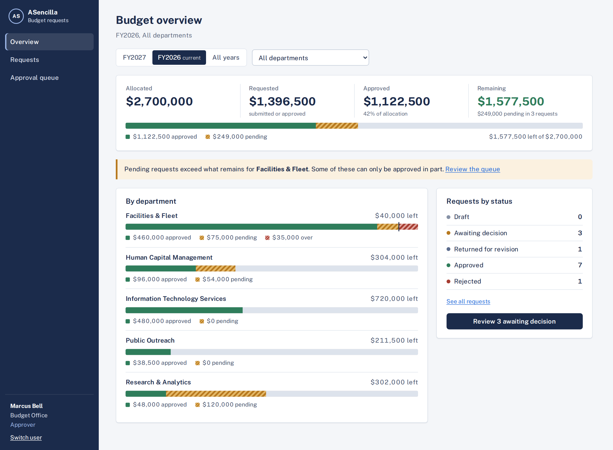
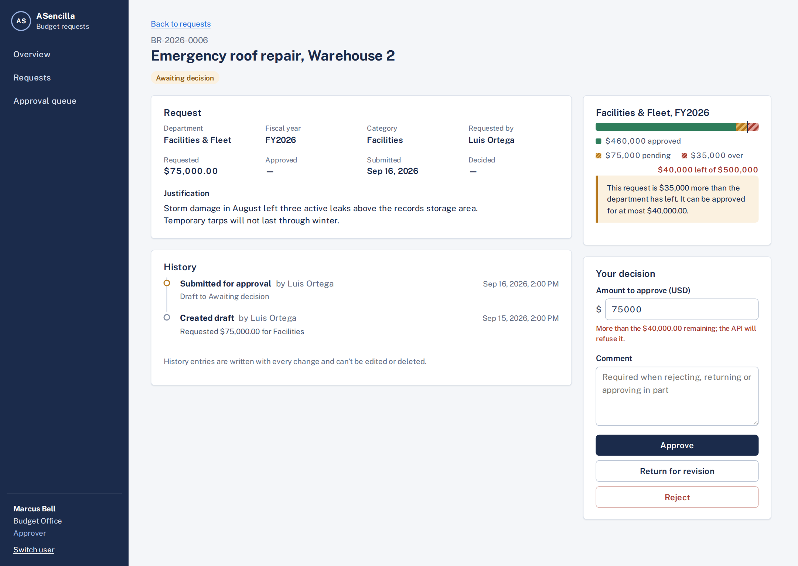
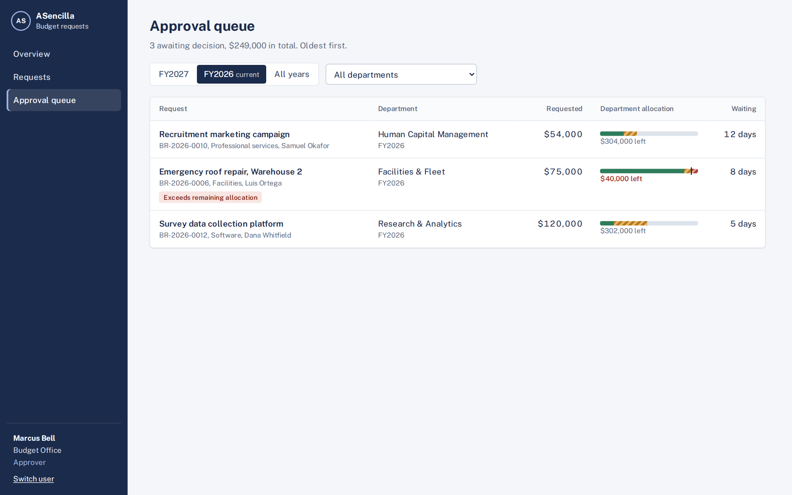

# Budget Planning & Approval — vertical slice

[](https://github.com/KKoGit/budget-approval-system/actions/workflows/api.yml)
[](https://github.com/KKoGit/budget-approval-system/actions/workflows/web.yml)

A small, complete budget-request workflow for a fictional public agency, the **Asencilla Regional Services Agency**. Departments draft and submit funding requests; the Budget Office approves (fully or in part), rejects, or returns them; every figure and every change is traceable.

It is intentionally a **polished vertical slice**, not a platform: five entities, five screens, ten API endpoints, one workflow — built the way the full product would be built.

| | |
|---|---|
| **Front end** | Angular 18 · standalone components · signals · reactive forms · route guards · HTTP interceptors |
| **API** | ASP.NET Core 8 Web API · Swagger/OpenAPI · RFC 9457 problem details |
| **Data** | Entity Framework Core 8 · SQLite by default (zero setup) · SQL Server by configuration |
| **Tests** | xUnit · 38 tests covering every business rule, including real-database concurrency tests |

All people, departments and amounts are invented.

[](https://codespaces.new/KKoGit/budget-approval-system?quickstart=1)


## Screenshots

**Dashboard.** Allocated, requested, approved and remaining for the fiscal year, with one allocation bar per department. Facilities & Fleet shows a pending request that is larger than what the department has left.



**Request detail with history.** An approver's view of the roof repair: the department's allocation, a warning that the request exceeds what remains, the decision panel, and the audit history.



**Approval queue.** Everything awaiting a decision, oldest first, with each department's remaining allocation and a flag on requests that exceed it.



<sub>Screenshots show the demo data the API seeds, viewed as Marcus Bell, a Budget Office approver.</sub>

---

## Live demo

**[Open the app](https://kkogit.github.io/budget-approval-system/)** · [API and Swagger](https://asencilla-budget-api-kpk-h7akeagchccvdecu.westus3-01.azurewebsites.net/swagger)

The Angular front end is hosted on GitHub Pages and the API on Azure App Service, both deployed by GitHub Actions on every push to `main` ([how it's deployed](docs/deployment.md)). A few things to know:

- **The first load can take 20–30 seconds.** The API runs on Azure's free plan, which sleeps when idle; the app shows a notice while it wakes up.
- **Sign-in is simulated.** Pick any person to see the app from their role.
- **The data is shared and may be reset.** Everyone uses the same demo database, so earlier visitors' changes may show up. If the walkthrough below doesn't match, run it locally or in Codespaces for a clean copy.

## Run it in GitHub Codespaces (nothing to install)

Click **Open in GitHub Codespaces** above. GitHub builds a cloud workspace with .NET 8 and Node 20 and installs all dependencies (about two minutes the first time). Then open two terminals:

```bash
# Terminal 1: API
cd backend/src/BudgetApproval.Api && dotnet run

# Terminal 2: web app
cd frontend && npm start
```

The web app opens in a new browser tab when it's ready. Each codespace is a private copy, so your changes don't affect anyone else, and it stops on its own when idle. Codespaces usage counts against the free monthly allowance of whoever opens it.

## Run it locally

**Prerequisites:** [.NET 8 SDK](https://dotnet.microsoft.com/download/dotnet/8.0) and [Node.js 20+](https://nodejs.org/) (18.19+ works).

```bash
# 1. API — creates and seeds budget-approval.db on first run
cd backend/src/BudgetApproval.Api
dotnet run                      # http://localhost:5080  (Swagger at /swagger)

# 2. Web app — in a second terminal
cd frontend
npm install
npm start                       # http://localhost:4200  (proxies /api to :5080)

# 3. Tests
cd backend
dotnet test
```

Open http://localhost:4200 and pick a person. There is no password; sign-in is simulated so you can switch roles instantly (see [security](docs/security.md)).

**Reset the demo data:** stop the API and delete `backend/src/BudgetApproval.Api/budget-approval.db`.

**Use SQL Server instead:** set `Database:Provider` to `SqlServer` in `appsettings.json` (the LocalDB connection string is already there) and run the API.

**Try the API directly:** in Swagger, click **Authorize** and enter a user id from 1 to 6.

---

## Ten-minute walkthrough

Each step exercises one business rule.

| # | Sign in as | Do this | You'll see |
|---|---|---|---|
| 1 | **Maya Chen** (IT, requester) | *New request* → enter −50 as the amount | Inline validation; the API would also refuse (`AMOUNT_MUST_BE_POSITIVE`) |
| 2 | Maya | Enter a valid request, **Save and submit** | Status *Awaiting decision*; history shows Created → Submitted |
| 3 | Maya | Open it and look for *Edit* | Gone: submitted requests are locked |
| 4 | **Marcus Bell** (Budget Office, approver) | *Overview* | Facilities' bar runs past its end: pending demand exceeds what remains |
| 5 | Marcus | *Approval queue* → *Emergency roof repair* → **Approve** $75,000 | Refused: only $40,000 remains (`ALLOCATION_EXCEEDED`) |
| 6 | Marcus | Change the amount to 40000, add a comment, **Approve in part** | Approved; Facilities now has $0 left |
| 7 | **Dana Whitfield** (R&A, requester *and* approver) | Open her *Survey data collection platform* | No decision panel: "another approver must decide it" |
| 8 | Marcus | Approve Dana's survey request | Allowed — it isn't his |
| 9 | **Priya Natarajan** (Outreach) | Open *Multilingual outreach materials* | The approver's reason; *Edit*, change the amount, **Save and resubmit**; history shows the change |
| 10 | Marcus in two browser windows | Open the same pending request in both; decide in one, then the other | The second gets **"changed by someone else"** with *Reload* — nothing is overwritten |
| 11 | Anyone | Switch fiscal year / department on the Overview, then go to Requests and the Queue | The same selection applies on all three screens |

---

## How it's built

A guide to the setup, with links to the files that show each part.

### API (ASP.NET Core 8)

- **Four projects with one-way dependencies.** `Domain` holds entities and business rules and depends on nothing. `Application` holds use-case services, DTOs and repository interfaces, and depends only on `Domain`. `Infrastructure` implements those interfaces with EF Core. `Api` is the thin web layer on top. → [`BudgetApproval.sln`](backend/BudgetApproval.sln)
- **All wiring in one place.** `Program.cs` registers the services, picks the database provider from configuration, sets a fallback authorization policy so every endpoint requires sign-in unless marked otherwise, adds an `Approver` policy, reads allowed CORS origins from configuration, and configures Swagger. → [`Program.cs`](backend/src/BudgetApproval.Api/Program.cs), [`DependencyInjection.cs`](backend/src/BudgetApproval.Infrastructure/DependencyInjection.cs)
- **Thin controllers.** Each action validates input and calls one application service; no business logic lives in controllers. → [`BudgetRequestsController.cs`](backend/src/BudgetApproval.Api/Controllers/BudgetRequestsController.cs), [`ApprovalsController.cs`](backend/src/BudgetApproval.Api/Controllers/ApprovalsController.cs)
- **One global error handler.** Business-rule violations become 422, stale versions 409, forbidden actions 403, hidden or missing records 404, and unexpected errors a generic 500. Every response is RFC 9457 problem details with a stable `code` the client can act on. → [`ApiExceptionHandler.cs`](backend/src/BudgetApproval.Api/Infrastructure/ApiExceptionHandler.cs)
- **EF Core configured deliberately.** Enums are stored as strings, check constraints and indexes match the queries, concurrency tokens detect conflicting writes, and `SaveChanges` refuses to modify or delete audit entries. The same model runs on SQLite or SQL Server. → [`BudgetDbContext.cs`](backend/src/BudgetApproval.Infrastructure/Persistence/BudgetDbContext.cs)
- **Repositories and a unit of work.** Database concurrency exceptions are translated into an application-level conflict, so the API layer never references EF Core. → [`OtherRepositories.cs`](backend/src/BudgetApproval.Infrastructure/Repositories/OtherRepositories.cs)
- **Pluggable authentication.** A small demo handler turns an `X-Demo-User` header into claims; swapping in Microsoft Entra ID means replacing this handler, not the controllers. The API refuses to run it outside Development unless explicitly allowed. → [`DemoAuthenticationHandler.cs`](backend/src/BudgetApproval.Api/Auth/DemoAuthenticationHandler.cs)
- **Swagger you can use.** The Authorize button accepts a demo user ID, so every endpoint can be tried as any role. → [live Swagger](https://asencilla-budget-api-kpk-h7akeagchccvdecu.westus3-01.azurewebsites.net/swagger)

### Front end (Angular 18, TypeScript)

- **Standalone components, signals and OnPush change detection** throughout, with no NgModules. Feature screens are lazy-loaded routes. → [`app.routes.ts`](frontend/src/app/app.routes.ts), [`app.config.ts`](frontend/src/app/app.config.ts)
- **A typed API client.** One service method per endpoint, returning typed observables; reference data is fetched once and shared. The TypeScript models mirror the API contracts. → [`budget-api.service.ts`](frontend/src/app/core/budget-api.service.ts), [`models.ts`](frontend/src/app/core/models.ts)
- **Three HTTP interceptors, in order.** One shows a notice if the hosted API is waking up, one attaches the signed-in identity, and one turns every failure into a typed `ApiError` and handles sign-out, connection and server errors centrally. → [`interceptors.ts`](frontend/src/app/core/interceptors.ts)
- **Route guards** for signed-in users, approver-only and requester-only screens, and a warning before leaving a form with unsaved changes. → [`guards.ts`](frontend/src/app/core/guards.ts)
- **Typed reactive forms with a custom validator** (amounts limited to two decimal places), plus a clear message when the API rejects a save, such as a stale version or a broken business rule. → [`request-form.component.ts`](frontend/src/app/features/requests/request-form.component.ts)
- **Shared state with signals.** The fiscal-year and department filter is one service used by the dashboard, list and queue, so every screen shows the same scope. → [`scope.service.ts`](frontend/src/app/core/scope.service.ts)
- **Reusable presentational components**, such as the allocation bar, which rescales to show demand beyond the budget. → [`allocation-bar.component.ts`](frontend/src/app/shared/allocation-bar.component.ts)
- **Environment-based configuration.** Local development calls `/api` through the dev-server proxy; the GitHub Pages build swaps in the Azure address and base path at build time. → [`proxy.conf.json`](frontend/proxy.conf.json), [`environment.github-pages.ts`](frontend/src/environments/environment.github-pages.ts), [`angular.json`](frontend/angular.json)

### Delivery (GitHub Actions and Azure)

- **API pipeline:** build, run all tests, publish, sign in to Azure with OIDC (no stored password), deploy to App Service, then smoke-test `/health`. → [`api.yml`](.github/workflows/api.yml)
- **Web pipeline:** build the Angular app for GitHub Pages and publish it. → [`web.yml`](.github/workflows/web.yml)
- **Decisions and setup steps** are written up in [docs/deployment.md](docs/deployment.md).

---

## Design decisions worth a look

**Business rules live in the domain, not in controllers.** `BudgetRequest` is a small state machine with no public setters; every transition validates its rule, appends an audit entry and issues a new version. There is no code path that changes a request without auditing it. → [`BudgetRequest.cs`](backend/src/BudgetApproval.Domain/Entities/BudgetRequest.cs)

**Concurrency at two levels.** Clients send the `version` they saw, so a decision made on a stale screen is refused (409). Separately, the allocation row carries its own concurrency token, so two approvers approving *different* requests for the same department at the same instant can't jointly overspend — the database refuses the second write. Both are proven against a real database. → [`ApprovalService.DecideAsync`](backend/src/BudgetApproval.Application/Services/ApprovalService.cs), [`ConcurrencyAndAuditTests`](backend/tests/BudgetApproval.UnitTests/Persistence/ConcurrencyAndAuditTests.cs)

**One definition of "FY2026, Facilities".** The dashboard, list and queue resolve filters through one policy (`BudgetScopePolicy`) and translate them to SQL in one place (`ApplyScope`); the UI uses one `ScopeService` and one `ScopeBar`. Requesters are pinned to their own department on the server, not just hidden in the UI. → [`BudgetScope.cs`](backend/src/BudgetApproval.Application/Common/BudgetScope.cs)

**Errors the UI can act on.** Every rule violation returns problem details with a stable code (`SELF_APPROVAL_NOT_ALLOWED`, `ALLOCATION_EXCEEDED`, …). Tests assert on codes, not wording.

**Seed data that obeys the rules.** The seeder calls the same domain methods as the API, so every seeded request has a real history and nothing in the demo is in an impossible state. → [`DbSeeder.cs`](backend/src/BudgetApproval.Infrastructure/Persistence/DbSeeder.cs)

---

## Documentation

| Document | Contents |
|---|---|
| [Architecture](docs/architecture.md) | System diagram, layer responsibilities, workflow state machine, approval sequence, API surface |
| [Assumptions and scope](docs/assumptions-and-scope.md) | Problem, personas, assumptions, what is in and deliberately out |
| [User stories](docs/user-stories.md) | Eleven stories with acceptance criteria, each linked to its tests |
| [Database design](docs/database-design.md) | ER diagram, constraints, indexes, design decisions, dashboard definitions, seed data |
| [Security](docs/security.md) | What is implemented, what is required before production, threats considered |
| [Testing](docs/testing.md) | Test strategy, rule-to-test map, what to automate next |
| [Production roadmap](docs/production-roadmap.md) | Three phases from pilot to reporting, plus team shape |
| [Limitations and tradeoffs](docs/limitations-and-tradeoffs.md) | Every shortcut, what it costs, and what would change it |
| [Deployment](docs/deployment.md) | Azure App Service and GitHub Pages hosting, passwordless CI/CD, setup checklist, costs |

---

## Repository layout

```
.github/workflows/
  api.yml                           build, test, deploy the API to Azure App Service
  web.yml                           build the front end, publish to GitHub Pages
.devcontainer/                      GitHub Codespaces setup
backend/
  BudgetApproval.sln
  src/
    BudgetApproval.Domain/          entities and business rules (no dependencies)
    BudgetApproval.Application/     use-case services, DTOs, scope policy, repository interfaces
    BudgetApproval.Infrastructure/  EF Core context, mappings, repositories, seed data
    BudgetApproval.Api/             controllers, demo auth, error handling, Swagger
  tests/
    BudgetApproval.UnitTests/       Domain/, Application/, Persistence/
frontend/
  src/app/
    core/                           API client, session, scope, guards, interceptors
    shared/                         scope bar, status badge, allocation bar, toasts
    features/                       dashboard, requests (list/form/detail), approvals
  src/environments/                 API address per build (local proxy vs hosted)
docs/                               the documents listed above
```

## Troubleshooting

- **"Cannot reach the API"** in the web app: the API isn't running on port 5080. Start it first.
- **Port 5080 in use:** change `applicationUrl` in `backend/src/BudgetApproval.Api/Properties/launchSettings.json` and `target` in `frontend/proxy.conf.json`.
- **Only a newer .NET SDK installed:** `global.json` rolls forward, so it builds; running needs the .NET 8 runtime, or change `TargetFramework` to your version in the five `.csproj` files.
- **API refuses to start outside Development:** intentional (demo auth guard). Use `dotnet run`, which sets Development.
