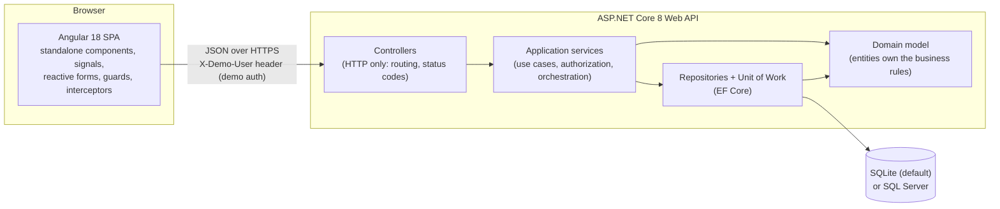
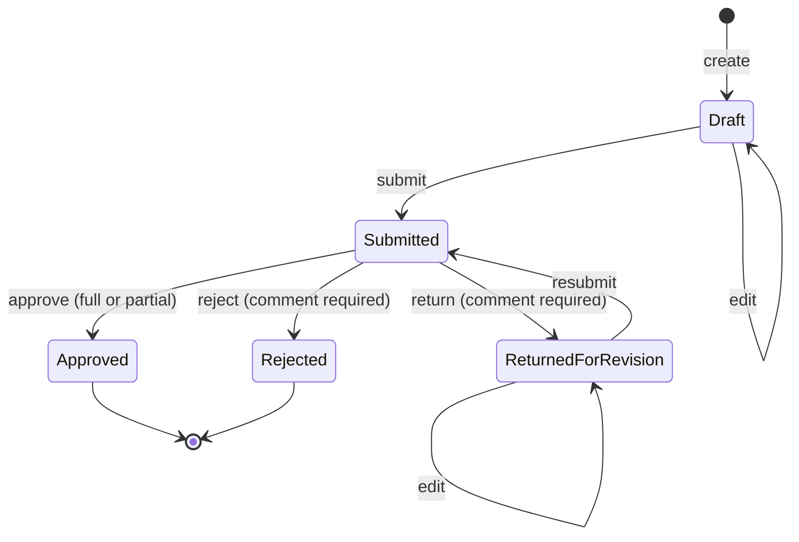
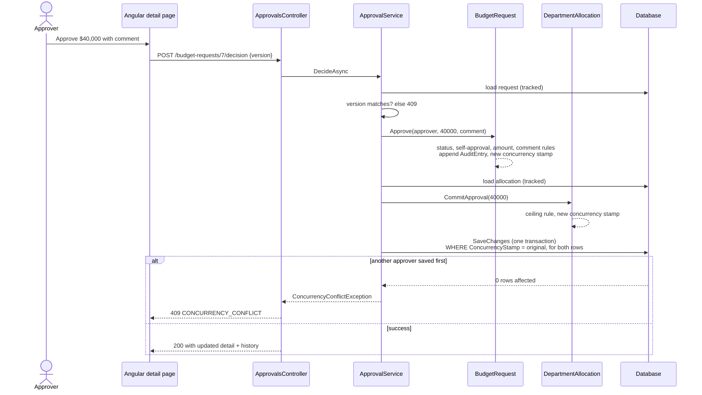

# Architecture

## System view



Dependencies point inward. The domain project references nothing, not even EF Core. The application project references only the domain and defines the interfaces (`IBudgetRequestRepository`, `IUnitOfWork`, `ICurrentUser` …) that infrastructure implements. The API is the composition root that wires everything together.

| Project | Responsibility | May reference |
|---|---|---|
| `BudgetApproval.Domain` | Entities, state machine, business-rule exceptions | nothing |
| `BudgetApproval.Application` | Use-case services, DTOs, scope policy, repository interfaces | Domain |
| `BudgetApproval.Infrastructure` | EF Core `DbContext`, entity mappings, repositories, seed data | Application, Domain |
| `BudgetApproval.Api` | Controllers, authentication, error mapping, Swagger, DI | all of the above |
| `BudgetApproval.UnitTests` | Domain, service and persistence tests | all src projects |

## Where each kind of logic lives

| Concern | Location | Why there |
|---|---|---|
| "Amount must be positive", "can't approve your own request", valid status transitions | `BudgetRequest` / `DepartmentAllocation` methods | Rules can't be bypassed by any caller; they are trivially unit-testable |
| "Only approvers may decide", "requesters see only their department" | Application services + `BudgetScopePolicy` | Authorization depends on who is calling, which the domain shouldn't know |
| Fiscal-year / department filtering | `BudgetScopePolicy` (who may see what) + `QueryScopeExtensions.ApplyScope` (how it becomes SQL) | One implementation shared by the list, queue and dashboard, so their numbers reconcile |
| Concurrency | Concurrency tokens on `BudgetRequest` and `DepartmentAllocation`; version check in services; `UnitOfWork` maps EF conflicts to 409 | Detects both stale screens and races between simultaneous saves |
| Audit | `BudgetRequest` appends an `AuditEntry` inside every state-changing method; `BudgetDbContext` refuses updates/deletes to entries | Auditing can't be forgotten by a new endpoint |
| HTTP concerns | Controllers and `ApiExceptionHandler` | Controllers stay one line per action |

## The approval workflow



## Anatomy of an approval



## Front end structure

```
src/app
├── core/                  singletons: API client, session, scope, notifications,
│                          guards (auth, approver, requester, unsaved changes),
│                          interceptors (demo auth header, error normalisation)
├── shared/                presentational components: scope bar, status badge,
│                          allocation bar, toast host
└── features/              one folder per screen, each lazy-loaded
    ├── login/             persona picker (demo only)
    ├── dashboard/
    ├── requests/          list, create/edit form, detail + decision + history
    └── approvals/         approval queue
```

Components are standalone and `OnPush`; state is held in signals, and HTTP streams are turned into signals with `toSignal`. `ScopeService` is the single source of truth for the fiscal-year/department filter shown on three screens.

## API surface (10 endpoints)

| Method | Route | Who |
|---|---|---|
| GET | `/api/demo/users` | anonymous (demo only) |
| GET | `/api/lookups` | signed in |
| GET | `/api/dashboard?fiscalYear&departmentId` | signed in (scoped) |
| GET | `/api/budget-requests?…filters, sort, page` | signed in (scoped) |
| GET | `/api/budget-requests/{id}` | signed in (scoped) |
| POST | `/api/budget-requests` | requester |
| PUT | `/api/budget-requests/{id}` | the request's author |
| POST | `/api/budget-requests/{id}/submit` | the request's author |
| GET | `/api/approvals/queue?fiscalYear&departmentId` | approver |
| POST | `/api/budget-requests/{id}/decision` | approver, not the author |

Errors are RFC 9457 problem details with a stable `code` (for example `ALLOCATION_EXCEEDED`, `SELF_APPROVAL_NOT_ALLOWED`, `CONCURRENCY_CONFLICT`) and a `traceId`. Status codes: 400 malformed input, 403 not permitted, 404 not found or not visible, 409 concurrency conflict, 422 business rule violated.
