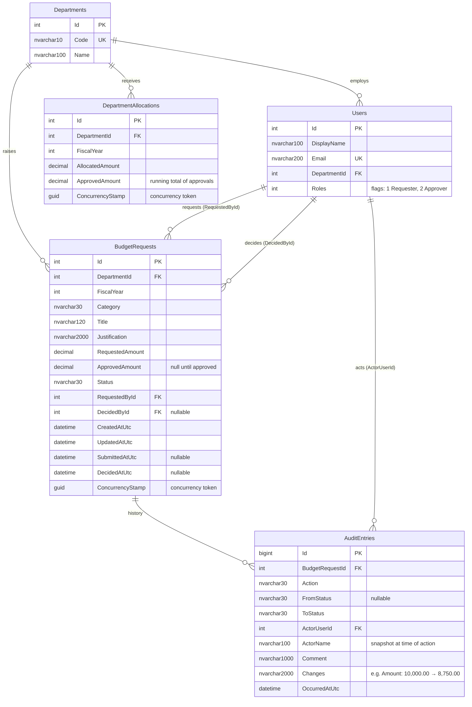

# Database design

Five tables. The schema is created from the EF Core model (`BudgetDbContext` + `EntityConfigurations.cs`) and works on both SQLite (default, zero setup) and SQL Server.

## Constraints and indexes

| Object | Purpose |
|---|---|
| `UX DepartmentAllocations (DepartmentId, FiscalYear)` | One ceiling per department per year |
| `CK_Allocation_WithinCeiling` | `0 ≤ ApprovedAmount ≤ AllocatedAmount` — the database refuses overspend even if application code is wrong |
| `CK_BudgetRequest_PositiveAmount` | `RequestedAmount > 0` |
| `IX BudgetRequests (FiscalYear, DepartmentId, Status)` | Serves the list, queue and dashboard, which all filter on these columns in this order |
| `IX BudgetRequests (RequestedById)` | "My requests" queries |
| `IX AuditEntries (BudgetRequestId, OccurredAtUtc)` | History for one request, in order |
| `UX Departments (Code)`, `UX Users (Email)` | Natural keys |
| All foreign keys `ON DELETE RESTRICT` | Records are never removed by cascade; audit history in particular must survive |

## Design decisions

**Approved total stored on the allocation.** `DepartmentAllocations.ApprovedAmount` duplicates the sum of approved requests. That is intentional: committing an approval *writes* the allocation row, so its concurrency token makes simultaneous approvals against the same allocation conflict instead of overspending. The check constraint backs this up. A reconciliation query (sum of approved requests = allocation approved total) belongs in operational monitoring; see the roadmap.

**Enums stored as strings.** `Status`, `Category` and `Action` are readable in the database (`'ReturnedForRevision'`, not `2`), which helps support staff, report writers and auditors. The cost is a few bytes per row.

**Actor name snapshot.** `AuditEntries.ActorName` is copied at the time of the action so history stays accurate if a user is renamed or leaves. `ActorUserId` still links to the user.

**UTC everywhere.** All timestamps are stored and returned in UTC with `Z`; the browser formats them locally. SQLite does not keep `DateTimeKind`, so a value converter re-stamps UTC on read.

**Money.** SQL Server uses `decimal(18,2)`. SQLite has no decimal type and cannot sort or compare decimals stored as text, so in SQLite mode money is stored as `REAL` and rounded to cents on read. That is acceptable for a demo database and is one of the reasons SQL Server is the production target (see [limitations-and-tradeoffs.md](limitations-and-tradeoffs.md)).

**Concurrency tokens.** A GUID `ConcurrencyStamp` regenerated by the domain on every change, rather than SQL Server `rowversion`, because it works identically on SQLite and SQL Server and is easy to pass through the API as a `version` string.

## Dashboard definitions

| Figure | Definition |
|---|---|
| Allocated | Sum of `AllocatedAmount` for the allocations in scope |
| Requested | Sum of `RequestedAmount` for requests that are **Submitted or Approved** (drafts aren't requests yet; returned requests are back with the requester; rejected requests are closed) |
| Approved | Sum of allocation `ApprovedAmount` (the committed figure) |
| Pending | Sum of `RequestedAmount` for **Submitted** requests |
| Remaining | Allocated − Approved |

## Seed data

`DbSeeder` creates 6 departments, 6 users, 10 allocations (FY2026 and FY2027) and 18 requests. Requests are built by calling the domain methods (`Create`, `Submit`, `Approve`, …) so the seed data passes every rule and each request has a genuine history. Notable rows:

| Reference | What it demonstrates |
|---|---|
| BR-2026-0002 | Partial approval with explanatory comment |
| BR-2026-0003 | Rejection with reason |
| BR-2026-0006 | Facilities roof repair ($75k) against $40k remaining: the allocation ceiling |
| BR-2026-0008 | Returned for revision; Priya can edit and resubmit |
| BR-2026-0012 | Dana's own request: self-approval is blocked for her, allowed for Marcus |
| BR-2027-0013 … 0018 | FY2027 planning: drafts and fresh submissions |

To reset, stop the API and delete `backend/src/BudgetApproval.Api/budget-approval.db`.
