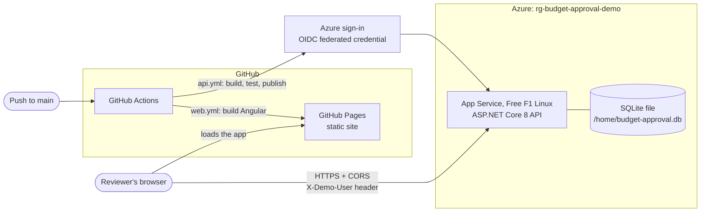

# Deployment

The live demo runs on free hosting: the Angular front end on **GitHub Pages** and the ASP.NET Core API on **Azure App Service (Free F1, Linux)**. Both are deployed by GitHub Actions on every push to `main`. No passwords or publish profiles are stored anywhere; the API pipeline signs in to Azure with a short-lived OpenID Connect (OIDC) token.

| | |
|---|---|
| **Web app** | https://kkogit.github.io/budget-approval-system/ |
| **API** | https://asencilla-budget-api-kpk-h7akeagchccvdecu.westus3-01.azurewebsites.net (Swagger at `/swagger`, health at `/health`) |
| **Azure resources** | Resource group `rg-budget-approval-demo`: Web App `asencilla-budget-api-kpk` on a Free F1 Linux plan in West US 3 |

## How it fits together

The browser downloads the static app from Pages, then calls the API on Azure directly. That makes it a cross-origin call, so the API allows exactly one origin, `https://kkogit.github.io`, and only the `Content-Type` and `X-Demo-User` headers.

## Pipelines

**`.github/workflows/api.yml`** runs when anything under `backend/` changes.
1. Restore, build and run all tests in Release mode. A failing test stops the pipeline, so nothing untested is deployed.
2. Publish the API and hand the output to the deploy job as a build artifact, so the tested build is exactly what gets deployed.
3. On `main` only: sign in to Azure with OIDC, deploy with `azure/webapps-deploy`, then smoke-test `/health` with retries to allow for a cold start.

**`.github/workflows/web.yml`** runs when anything under `frontend/` changes.
1. Install with `npm ci` (exact versions from the lockfile) and build with `--configuration production,github-pages`. That configuration swaps in `environment.github-pages.ts` (the Azure API address) and sets the base path to `/budget-approval-system/`.
2. Copy `index.html` to `404.html`. Pages has no server-side rewrites, so this is what makes deep links such as `/requests/5` load after a refresh.
3. On `main` only: publish to Pages with `actions/deploy-pages`.

Pull requests run the build and test steps only, which makes both workflows useful as CI checks.

## Configuration

The API reads everything environment-specific from App Service **app settings**, never from edited files. The double underscore is how nested `appsettings.json` keys are written as environment variables.

| App setting | Value | Why |
|---|---|---|
| `Authentication__AllowDemoAuthOutsideDevelopment` | `true` | The API refuses to run simulated sign-in outside Development unless this is set explicitly. Acceptable only because all data is fictional. |
| `Cors__AllowedOrigins__0` | `https://kkogit.github.io` | The only origin allowed to call the API from a browser. |
| `ConnectionStrings__Sqlite` | `Data Source=/home/budget-approval.db` | `/home` is App Service's persistent storage on Linux. The app folder is replaced on every deployment, so the default path would lose the data. |

The front end's API address is set at build time in `frontend/src/environments/`. Local development and Codespaces use a relative `/api`, proxied by the dev server; the Pages build uses the Azure address.

## One-time setup checklist

The Azure resources were created in the portal: a resource group, then a Web App (.NET 8 LTS, Linux, Free F1) with basic authentication disabled, HTTPS only and minimum TLS 1.2, plus the three app settings above. What remains connects GitHub to Azure without a password.

**1. Create an identity for the pipeline (Microsoft Entra ID).**
In the Azure portal, open **Microsoft Entra ID**, then **App registrations**, then **New registration**. Name it `github-budget-approval-deploy`, keep "Single tenant", leave Redirect URI empty, and register. From its Overview page, note the **Application (client) ID** and **Directory (tenant) ID**.

**2. Trust GitHub's tokens for this repository and branch only.**
In the same app registration, open **Certificates & secrets**, then **Federated credentials**, then **Add credential**. Choose the scenario **GitHub Actions deploying Azure resources**, then enter organization `KKoGit` (capitalized exactly like the GitHub account; Azure matches this case-sensitively), repository `budget-approval-system`, entity type **Branch**, branch `main`, and name `main-branch`. Only workflows running on `main` of this repository can now sign in as this identity.

**3. Give it the smallest role that can deploy.**
Open the Web App `asencilla-budget-api-kpk`, then **Access control (IAM)**, then **Add**, then **Add role assignment**. Choose the role **Website Contributor**, assign access to "User, group, or service principal", select `github-budget-approval-deploy`, and review and assign. The scope is this one Web App, not the resource group or subscription.

**4. Add the three IDs to GitHub.**
Find the **Subscription ID** under **Subscriptions** in the portal. In the GitHub repository, open **Settings**, then **Secrets and variables**, then **Actions**, then **New repository secret**, and add `AZURE_CLIENT_ID`, `AZURE_TENANT_ID` and `AZURE_SUBSCRIPTION_ID`. These are identifiers, not passwords; they're stored as secrets to keep them out of logs.

**5. Turn on GitHub Pages.**
In the GitHub repository, open **Settings**, then **Pages**, and set **Source** to **GitHub Actions**.

**6. Run both pipelines.**
Push to `main`, or open the **Actions** tab and run **API** and **Web** manually with "Run workflow". Both should finish green, and the live links above should work.

**7. (Optional) Health check.**
In the Web App, open **Configuration**, then **Health check**, enable it with path `/health`, and save. Azure then monitors the endpoint and reports failures.

## Decisions and tradeoffs

**Free F1 plan.** It costs nothing but allows 60 CPU minutes a day, 1 GB of memory, no SLA, and no "Always on", so the API sleeps when idle and the first request after a quiet period takes 20–30 seconds. The front end shows a "waking up" notice when a response takes longer than four seconds. For anything beyond a demo, a Basic B1 plan with Always on removes the cold start.

**Split hosting: Pages for the front end, App Service for the API.** The Angular app is static files, and Pages serves them free from a global CDN; only the API needs a server. The cost is a cross-origin setup (CORS plus an absolute API address at build time). Serving both from one App Service would avoid CORS but would tie front-end releases to the API's plan and cold starts.

**OIDC federated credentials instead of a publish profile.** A publish profile is a long-lived password that must be rotated and can leak. With OIDC, GitHub issues a token per run that Azure accepts only from this repository's `main` branch. Basic (FTP/SCM) authentication is disabled on the Web App, so password-based deployment isn't possible at all.

**Least-privilege role.** The pipeline identity has Website Contributor on one Web App. It can deploy and restart the app, but it can't create resources, read other apps or change access.

**SQLite on App Service.** Zero cost and zero setup. The trade-offs: data is shared by every visitor; SQLite allows one writer at a time (fine at demo traffic); and it works only with a single instance, which is all the Free plan runs anyway. The production target is Azure SQL with EF Core migrations; see the [production roadmap](production-roadmap.md).

**Region West US 3.** East US was the first choice, but new subscriptions often start with an F1 quota of zero there. West US 3 had capacity. The extra latency from the East Coast is a fraction of a second.

**Secure unique default hostname.** Azure adds a random suffix to the app's address, which prevents someone from claiming the same name if the app is ever deleted (subdomain takeover). The cost is a longer URL.

**.NET 8 support ends on November 10, 2026.** The app targets .NET 8 LTS. Moving to .NET 10, the current LTS, is a retarget-and-recompile task: update `TargetFramework`, the EF Core and ASP.NET packages, `global.json`, the workflow's `dotnet-version` and the App Service runtime stack.

## Operating the demo

**Reset the demo data.** In the Web App, open **Development Tools**, then **SSH**, and run `rm /home/budget-approval.db`. Then **Restart** the app from its Overview page. The API recreates and reseeds the database on the next request, with dates relative to today.

**View logs.** Open **Monitoring**, then **Log stream** in the Web App. For history, enable Application Insights under **Monitoring**, then **Application Insights**; demo traffic stays well within its free allowance.

**Cost.** Everything used is free: the F1 plan, GitHub Pages for a public repository, and GitHub Actions minutes for a public repository. A $1 monthly budget alert under **Cost Management** gives early warning if that ever changes.

**Tear down.** Delete the resource group `rg-budget-approval-demo` to remove every Azure resource. Also delete the `github-budget-approval-deploy` app registration in Entra ID, since it lives outside the resource group.

## Troubleshooting

| Symptom | Likely cause |
|---|---|
| API workflow fails at "Sign in to Azure" with `AADSTS70021` or "no matching federated identity" | The federated credential's organization, repository or branch doesn't exactly match `KKoGit/budget-approval-system` on `main`, including capitalization. |
| API workflow fails at "Deploy" with 403 or "authorization failed" | The role assignment is missing or on the wrong resource. Check **Access control (IAM)** on the Web App. |
| Web app shows "Cannot reach the demo server" and the browser console mentions CORS | `Cors__AllowedOrigins__0` doesn't exactly match `https://kkogit.github.io` (lowercase, no trailing slash). Restart the Web App after changing it. |
| API returns 500.30 or "application failed to start" | Check **Log stream**. The most common cause is a missing `Authentication__AllowDemoAuthOutsideDevelopment` setting, which makes the API refuse to start by design. |
| Pages shows a 404 for the whole site | Pages source isn't set to **GitHub Actions**, or the Web workflow hasn't run yet. |
| Page loads but is blank, and the console shows 404s for `.js` files | The base path doesn't match the repository name. If the repository isn't named `budget-approval-system`, update `baseHref` in the `github-pages` configuration in `frontend/angular.json`. |
